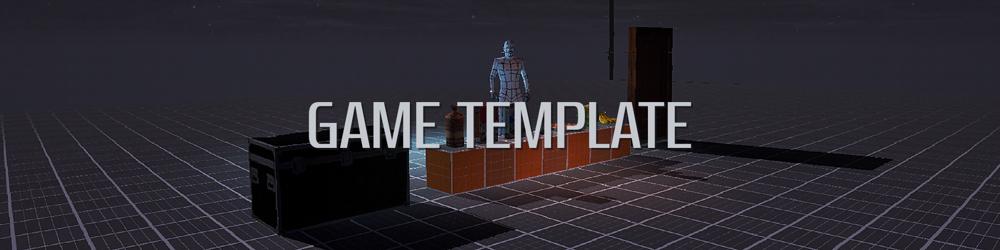
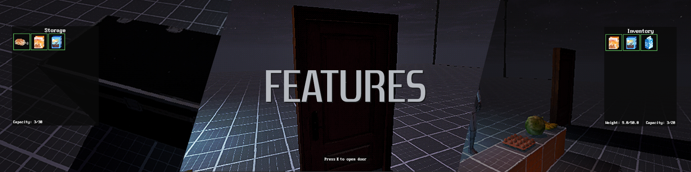

# PSX Game Template (Unreal Engine)

## Overview

A fully-featured PlayStation-style first-person game template built in **Unreal Engine**, designed for rapid prototyping, learning, and professional game development.
This project focuses on modularity, clarity, and production-ready systems—making it ideal for developers who want a strong foundation for PSX-inspired experiences.

This template includes a complete first-person controller, a modular inventory and interaction system, PSX-style rendering effects, UI frameworks, audio setups, and ready-to-extend gameplay features.
All core systems are implemented primarily in C++, with Blueprint used only where it makes sense for rapid iteration and designer-friendly adjustments.

---

## Features

### **Inventory System**

* Stackable & non-stackable items
* Drag-and-drop inventory management
* Storage containers & world item interactions
* Item usage logic & quantity handling

### **PSX Rendering & Shader Effects**

* Pixelated retro visual profile
* Vertex wobble / jitter
* Affine texture warping
* Old-school fog & VHS effects

### **Audio Setup**

* Organized Sound Classes & Sound Mixes
* Dialogue and in-game audio routing
* Included SFX for quick iteration

### **First-Person Controller**

* Smooth movement with crouching & sprinting
* Interaction tracing & prompts
* Optimized for PSX-inspired projects

### **Pickup & Storage System**

* World pickups with quantity support
* Storage containers linked to the main inventory
* Modular blueprint structure for expansion

### **Interaction Framework**

* Focus highlights
* Timed interactions
* Modular actors for future gameplay features

### **UI / Menus**

* Complete main menu system
* Ready-to-extend UI architecture for new screens

---

## How to Extend the Template

### **Adding New Items**

Create new items by extending the `ID_Consumables` Blueprint class.
Here you can define:

* Mesh
* Icon
* Properties & stats
* Behavior on use

## Planned Updates / Roadmap

* NPC interactions & dialogue
* Landscape master material
* Discord Rich Presence
* “PS1.5” enhanced graphics mode
* Third-person controller support

---

## Development Status

This project is under **active development**, with continuous improvements to systems, visuals, tools, and overall usability.

## Contact

- **https://anastasismarinos.com**

---
